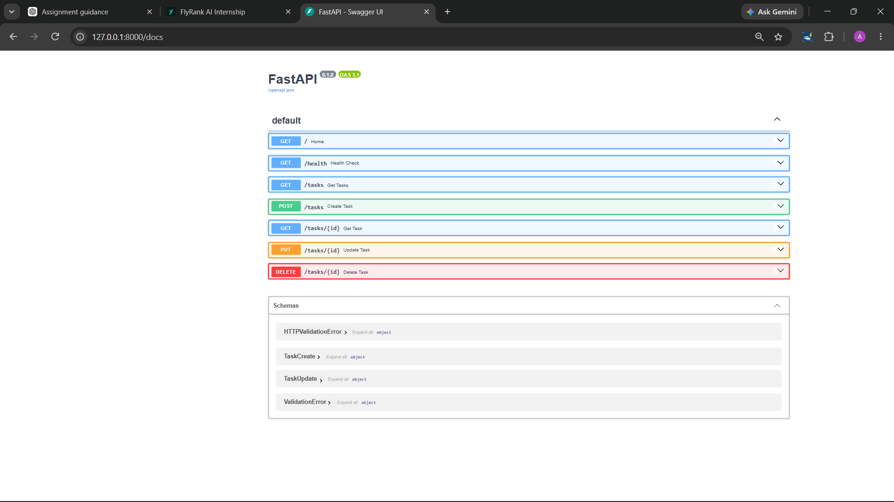

# Task API

A small CRUD API built with Python and FastAPI.

The API manages an in-memory to-do list. It supports creating,
reading, updating, and deleting tasks.

## Requirements

- Python 3.10+
- FastAPI
- Uvicorn

## Installation and Run

Create and activate a virtual environment:

```bash
python -m venv .venv

## Example curl Output

HTTP/1.1 200 OK
date: Sun, 13 Sep 2026 13:20:05 GMT
server: uvicorn
content-length: 15
content-type: application/json

## Swagger UI

The API can be tested interactively using FastAPI's Swagger UI.

